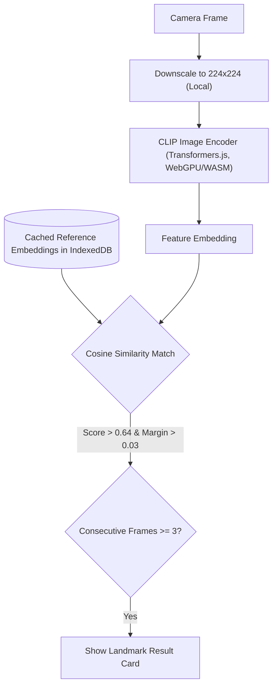
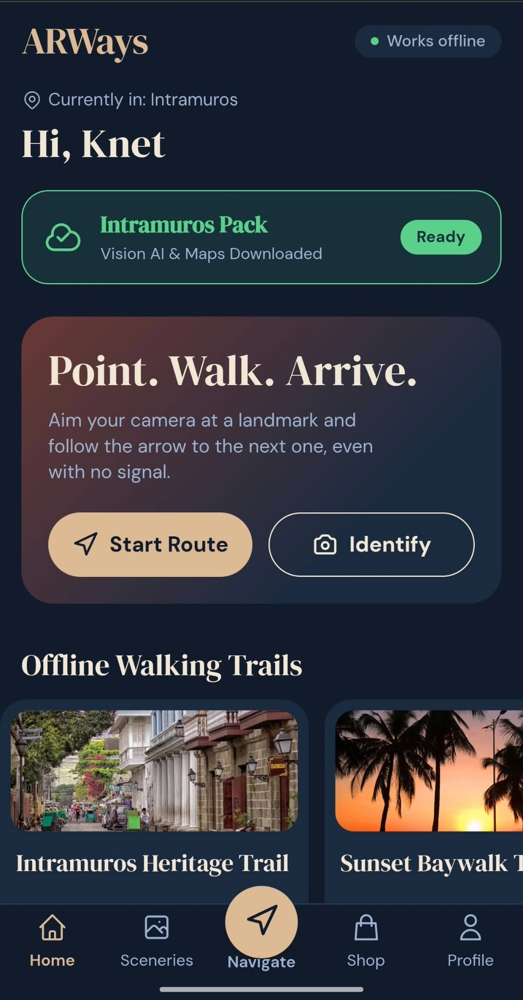
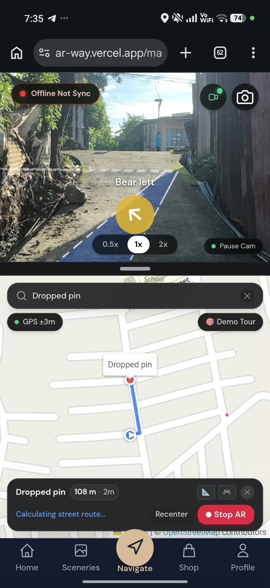
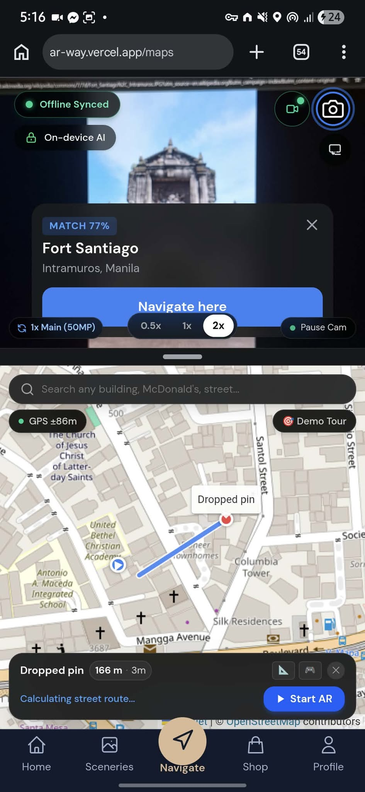
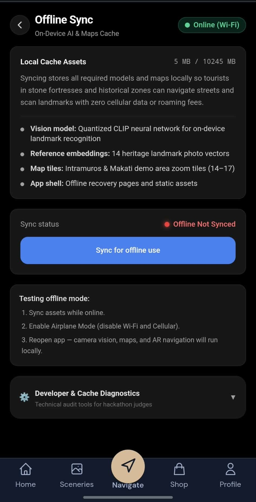

# ARWay
A mobile-first walking navigation app built for tourists exploring heritage zones.
Built for AppBuildersPH Hackathon 2026 · Local AI

* [The project](#the-project)
* [What it does](#what-it-does)
* [How the on-device AI works](#how-the-on-device-ai-works)
* [The proof](#the-proof)
* [The disclosures](#the-disclosures)
* [Why does this product benefit from running AI locally?](#why-does-this-product-benefit-from-running-ai-locally)
* [Run it yourself (for judges)](#run-it-yourself-for-judges)
* [Known limitations](#known-limitations)
* [Acknowledgments](#acknowledgments)

## The project
- **Project name:** ARWay
- **Short description:** ARWay is a mobile-first walking navigation app. It shows your route as a line on the live camera view with a map below, and it recognizes landmarks with an AI model that runs entirely on your phone, so it keeps working when the signal drops.
- **Team name:** Sector 4
- **Team members:** 

| Name | Role |
|---|---|
| Mark Kenneth Galario | Team Lead, Backend, AI/ML |
| Kirby Caranyagan | AI/ML, Backend |
| Abegail Sonsona | UI/UX, Frontend, Marketing |
| Mark Andrew Cruz | UI/UX, Frontend, Storyteller |

- **GitHub repository:** https://github.com/knet-the-traveller/ARWay
- **Live demo (optional):** https://ar-way.vercel.app
- **Hardware tested on:** Android phone, Android 10, Chrome 154 (mobile), 8 CPU cores, 8 GB RAM, WebGPU available. Phone model: POCO X8 Pro. SAMSUNG A54 5G. Laptop used for development and the demo: ASUS V16. Not yet tested on iPhone/Safari. The UI is laid out for a 375x667 viewport.

## What it does
- Camera on top and map on the bottom; resizable camera/map split screen
- AR ground line that follows a walking route using GPS and compass
- Landmark recognition from the camera using on-device AI
- Place search over saved places and online
- Sceneries guide and Shop directory
- Community feed with photo and location posts
- Profile with gamified badges and saved places
- Offline PWA mode via Service Worker

## How the on-device AI works
Zero-shot nearest-neighbour matching against a small set of reference photos (limited to the places in the app). The model extracts image feature embeddings on the client.

The embeddings for reference places (sceneries) are generated using crops and flips (5 variations per image) and cached in IndexedDB. The thresholds used in the app are 0.64 for the minimum score and 0.03 for the minimum margin over the runner-up, requiring 3 consecutive confirming frames to validate a match.

## The proof
- **Demo video (about 1 minute):** **[TO BE ADDED]**
- **X / LinkedIn video post:** https://lnkd.in/p/guqHBtbY
- **Screenshots:** 

| Home Feed | AR Navigation View | Landmark Recognition Result | Offline Setup Page |
|---|---|---|---|
|  |  |  |  |

- **Measured performance:** Measured on the in-app test page with 224x224 inputs on the Android phone above, WebGPU backend, during development; numbers will vary by device.
  | Metric | Value |
  |---|---|
  | Model load | 4.3 s and 5.1 s (two runs) |
  | Average inference per image | ~1.2 to 1.3 s (min: 0.95-1.1 s, max: 1.4 s) |
  | Live scanner debug reading | ~1.4 s per frame |
  | Known outlier | One stall of ~91-93 s (on full-res camera photo before downsizing/warm-up fixes). |
  *Battery use and memory use have not been measured.*

- **What runs locally:** 
  - The CLIP image encoder inference and all landmark matching
  - The reference-embedding cache
  - Camera frame processing (frames are never uploaded or stored)
  - GPS, compass, and tilt processing
  - Route snapping, steering logic, the perspective projection, and drawing of the AR line
  - Searching saved places (Sceneries and Shop)
  - The service worker and offline cache
  - Posts, likes, and the mock profile (saved only in the browser's localStorage on that device, with no backend)
- **What requires internet:** 
  - First-time download of the model files (Hugging Face) and the ONNX runtime files (jsDelivr), after which they are cached
  - Map tiles from OpenStreetMap (only the demo areas prepared on the offline setup page are available offline)
  - Walking route lookup (first time for each destination via routing.openstreetmap.de or project-osrm.org, after which it is saved; falls back to straight line if unavailable)
  - Online place search and reverse geocoding (Nominatim) when posting with a location
  - Loading the deployed site for the first time
  *No cloud AI API is used anywhere.*

- **Try it offline:**
  1. Open the production site online.
  2. Open the offline setup route.
  3. Tap Prepare offline.
  4. Tap Verify.
  5. Turn on airplane mode.
  6. Reopen the app.

## The disclosures
### Models used
| Model Name | Task | Runs Where | Format | Source | License |
|---|---|---|---|---|---|
| Xenova/clip-vit-base-patch32 | Image feature extraction for landmark recognition | Browser on-device via WebGPU/WASM | ONNX (q8 quantization) | Hugging Face | MIT |

No other model is used and no model was trained or fine-tuned by the team.

### Technologies and frameworks
- Next.js 16.4.0 (App Router, Turbopack)
- React 19.3.0
- TypeScript 5
- Tailwind CSS v4
- Leaflet 1.9.4 and react-leaflet 5.0.0
- @huggingface/transformers 4.3.1 (with ONNX Runtime Web, WebGPU/WASM)
- Browser APIs: getUserMedia, Geolocation, DeviceOrientation, Canvas 2D, Service Worker, Cache API, IndexedDB, localStorage.
- Hosting: Vercel.
- The service worker is hand-written (no PWA library).

### APIs and cloud services
| Service | What it is used for | When it is called |
|---|---|---|
| OpenStreetMap tile servers | Map tiles | When viewing the map without offline cache |
| routing.openstreetmap.de / project-osrm.org | Walking routing server | First time routing to a destination |
| Nominatim | Place search and reverse geocoding | When posting with a location |
| Hugging Face CDN | Model files | First-time download of the AI model |
| jsDelivr | ONNX runtime files | First-time load of transformers.js runtime |
| Vercel | Hosting | Initial site load |

No API keys are used; no cloud AI/LLM API is used. 
*Map data © OpenStreetMap contributors (ODbL)*

### Existing code and assets
- Open-source libraries and the model above (not written by the team).
- Image assets: All photos and images used (e.g. Sceneries, Shops) are generic placeholder assets collected from the internet during the hackathon proper for reference and display purposes, and are not owned by the team.
- Placeholder content: shop listings are generic placeholders, feed seed posts and usernames are fictional, app icons are temporary placeholders.
- Development timeline and pre-existing work:
  - Base Next.js app scaffolding, UI components (feed, shop, profile, sceneries, map placeholders), routing logic, and PWA setup were rapidly committed starting from October 9, 2026, pivoting heavily into integrating the real on-device AI recognition model, live camera scanner, and AR perspective drawing algorithms on the same day. 
  - Significant bug-fixing and UI/UX modernization continued through October 10. 
  - All code and assets were built during the hackathon proper.
- Files generated by tools are standard scaffolding.

### AI development tools
- **Google Antigravity:** used as the primary autonomous AI coding agent to implement the application, sensor math, and offline architecture.
- **Gemini (Google DeepMind):** used for system design, sensor algorithm reasoning, and compliance documentation.
- **Claude (Anthropic):** used for project planning and for writing and refining the prompts given to Antigravity.
- *Detailed full disclosures available in [`disclosure.md`](./disclosure.md).*
- All AI-assisted code was reviewed, debugged, and tested on physical mobile hardware by the team.

## Why does this product benefit from running AI locally?
1. **Works when the cloud disappears:** tourists in places like Intramuros or Rizal Park often have weak or expensive mobile data; recognition keeps working in airplane mode once the app is prepared.
2. **Privacy:** live camera frames of streets and people are processed on the phone and never uploaded.
3. **Speed and bandwidth:** recognition runs on every second or so of video; uploading frames to a server would need constant bandwidth and a round trip for each frame.
4. **Cost and scale:** no per-request inference bill; the app scales to many users without a server GPU.
5. **Honest trade-offs:** first-time setup needs a download of the model, recognition is limited to the places we have reference photos for, and routing and map tiles still need the internet unless prepared. This is a hybrid design: AI is local, maps and routing are cloud services with offline fallbacks.

## Run it yourself (for judges)
- **Prerequisites:** Node.js >= 20 and npm.
- **Commands:** 
  - `npm install`
  - `npm run dev`
  - `npm run build` && `npm run start`
  - *Note: Camera, GPS, and compass APIs require HTTPS or localhost. For testing on a phone, use the Vercel deployment or a secure HTTPS tunnel. The service worker and offline features only run effectively in the production build.*
- **Required environment variables:** none.
- **Project structure:**
  - `app/` - Next.js App Router endpoints and pages
  - `components/` - React UI components, icons, and the core AR/Map interactive elements
  - `lib/` - Core logic for routing, geospatial math, offline caching, and the Hugging Face AI pipeline
  - `hooks/` - React hooks for interfacing with hardware sensors
  - `public/` - Static assets, images, web manifest, and the Service Worker

## Known limitations
- GPS is only accurate to roughly 3 to 10 m and compass drift can make the AR line wobble, so it is a guide, not a precise path (the line is a 2D projection from sensors, not true visual tracking).
- Recognition may confuse similar-looking places and works only for the places in the app.
- Tested on one Android phone so far.
- Posts, likes, and the profile are local to each device with no sync or real accounts.
- Offline maps cover only prepared demo areas.
- The demo areas and shop data are placeholders.
- **Always keep your eyes on your surroundings and stay on the sidewalk while walking.**

## Acknowledgments
OpenStreetMap contributors, Hugging Face and Transformers.js, OpenAI CLIP, Xenova model conversions, Leaflet, Next.js, Vercel, AppBuildersPH.
